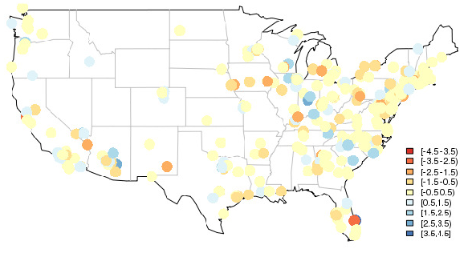
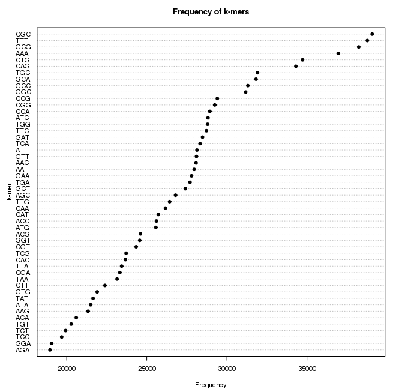

rhadoop-examples
==================

Repository of applications built with Rhadoop.

## Wordcount

There's no need for introductions.


## Sentiment Analysis

Receive as input tweet messages and apply a sentiment analysis function to each message. The [function](http://jeffreybreen.wordpress.com/2011/07/04/twitter-text-mining-r-slides/) was built by Jeffrey Breen, with opinion lexicons based on a [book](http://citeseerx.ist.psu.edu/viewdoc/download?doi=10.1.1.244.9480&rep=rep1&type=pdf) by Bing Liu among [other materials](http://www.cs.uic.edu/~liub/FBS/sentiment-analysis.html).

Take also a look at the packages [**sentiment**](http://cran.r-project.org/src/contrib/Archive/sentiment/) (archived on 2012) and [**qdap**](http://cran.r-project.org/web/packages/qdap/index.html) (function *polarity*).

To generate the dataset you have to configure the `twitter-streaming.py` script with you account information. To execute it run the following command:

```bash
./twitter-streaming.py <keyword> <language> > <output_file>
```

The test ```sentiment-analysis-test.R``` requires tweet messages with geolocation information to plot the results in a map. To filter the dataset use the command:

```bash
./tweet-filter.py <input_file> coordinates
```



## K-mers

Creates a histogram of the k-mers of a sequence in the FASTQ format. The test dataset is a sample from the *e. coli* bacteria, the full dataset can be downloaded from [here](https://s3.amazonaws.com/public.ged.msu.edu/ecoli_ref-5m.fastq.gz).



## Other applications
- Inverted Index
- Inverted Citations

License
----

MIT
